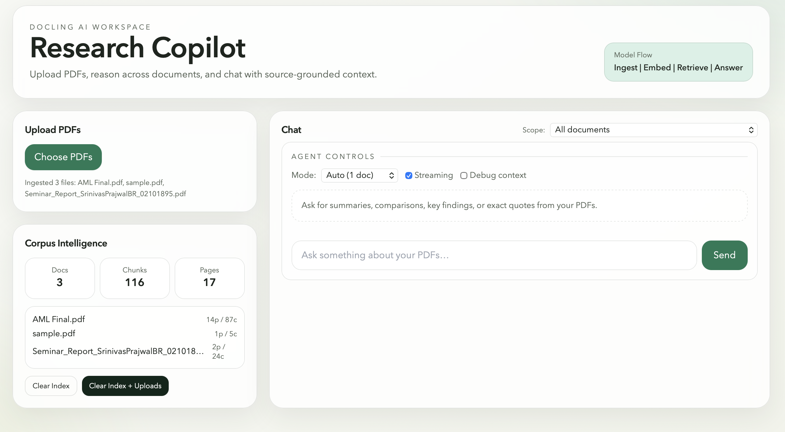

# Docling

Production-style, open source RAG workspace for PDF intelligence — fully free, no OpenAI required.

[](https://www.python.org/)
[](https://fastapi.tiangolo.com/)
[](https://react.dev/)
[](https://www.typescriptlang.org/)
[](LICENSE)

Docling ingests PDFs, builds a local FAISS index, and exposes grounded Q&A, streaming responses, auto-briefing, and follow-up suggestions through a FastAPI backend and a modern React UI. The entire stack runs free — Groq LLaMA 3.3 70B for chat, local HuggingFace embeddings for retrieval.

## Screenshot



## Why Docling

- **100% free** — Groq free tier for chat, local embeddings, no credit card
- **Zero config** — paste your Groq key in the browser once, everything works
- **Auto-briefing** — instant summary + 5 starter questions on every upload
- **Source-grounded answers** with page-level citations
- **Streaming chat** and follow-up suggestions for interactive analysis
- **Corpus intelligence** panel (documents, chunk count, page count)
- **File-scoped or cross-document** reasoning modes

## Core Features

- `POST /api/ingest` — multi-file PDF ingestion with auto-brief generation
- `POST /api/chat` — standard answer generation
- `POST /api/chat/stream` — SSE token streaming
- `POST /api/chat/suggest` — context-aware follow-up questions
- `GET /api/docs` and `DELETE /api/docs` — corpus lifecycle control

## Architecture

```text
React (Vite + TypeScript) UI
        |
        | HTTP / SSE  +  X-Groq-API-Key header
        v
FastAPI API Layer
  - ingest router  (PDF → chunks → FAISS + auto-brief)
  - chat router    (retrieve → general assistant prompt → stream)
  - docs router    (corpus stats)
        |
        | retrieval
        v
HuggingFace all-MiniLM-L6-v2 (local embeddings) + FAISS
        |
        | generation
        v
Groq API — LLaMA 3.3 70B (free tier)
```

## Tech Stack

- **Backend**: FastAPI, Uvicorn, Pydantic Settings
- **Retrieval**: LangChain, FAISS, PyPDF, HuggingFace sentence-transformers (local)
- **Chat**: Groq `llama-3.3-70b-versatile` via `langchain-groq`
- **Frontend**: React 19, TypeScript, Vite, Tailwind CSS

## Repository Layout

```text
.
├── backend/
│   ├── app/
│   │   ├── core/            # config and settings
│   │   ├── routers/         # API endpoints (ingest, chat, docs)
│   │   └── vectorstores/    # FAISS and optional Pinecone wrappers
│   ├── data/uploads/        # uploaded PDF files
│   ├── storage/faiss/index/ # local vector index
│   └── requirements.txt
├── frontend/
│   ├── src/components/      # Chat, Upload
│   ├── src/lib/api.ts       # typed API client
│   └── package.json
└── .env.example
```

## Quick Start

### 1. Clone

```bash
git clone https://github.com/avneetxsingh/docling.git
cd docling
```

### 2. Start backend

```bash
cd backend
python3 -m venv .venv
source .venv/bin/activate
pip install -r requirements.txt
cd ..
source backend/.venv/bin/activate
uvicorn app.main:app --app-dir backend --host 127.0.0.1 --port 8001 --reload
```

On first start, the embedding model (~90MB) downloads automatically. You'll see:

```
Loading embedding model 'all-MiniLM-L6-v2'...
Embedding model ready.
```

### 3. Start frontend

```bash
cd frontend
npm install
echo "VITE_BACKEND_URL=http://127.0.0.1:8001" > .env
npm run dev -- --host 127.0.0.1 --port 5173
```

### 4. Open and enter your Groq key

Open `http://127.0.0.1:5173`. On first launch, paste your free Groq API key from [console.groq.com](https://console.groq.com). It's saved in your browser — you won't be asked again.

## How Auto-Briefing Works

Every time you upload a PDF, Docling immediately:
1. Ingests and indexes the document
2. Generates a 2-3 sentence summary
3. Suggests 5 specific starter questions

The brief card appears in the sidebar. Click any question to scope the chat to that document and fire it instantly.

## API Surface

- `GET /api/health` — health check
- `POST /api/ingest` — upload and index PDFs, returns brief per file
- `POST /api/chat` — RAG answer endpoint
- `POST /api/chat/stream` — SSE streaming endpoint
- `POST /api/chat/suggest` — follow-up question suggestions
- `GET /api/docs` — corpus stats
- `DELETE /api/docs?clear_uploads=true|false` — clear corpus state

Interactive API docs: `http://127.0.0.1:8001/docs`

## Troubleshooting

- **`Address already in use`** on backend:

```bash
pkill -f "uvicorn app.main:app" || true
```

- **Frontend cannot connect to backend**: ensure `frontend/.env` contains `VITE_BACKEND_URL=http://127.0.0.1:8001`

- **Groq rate limit**: the free tier has generous limits but may throttle under heavy load — wait a moment and retry.

## License

MIT. See `LICENSE`.
